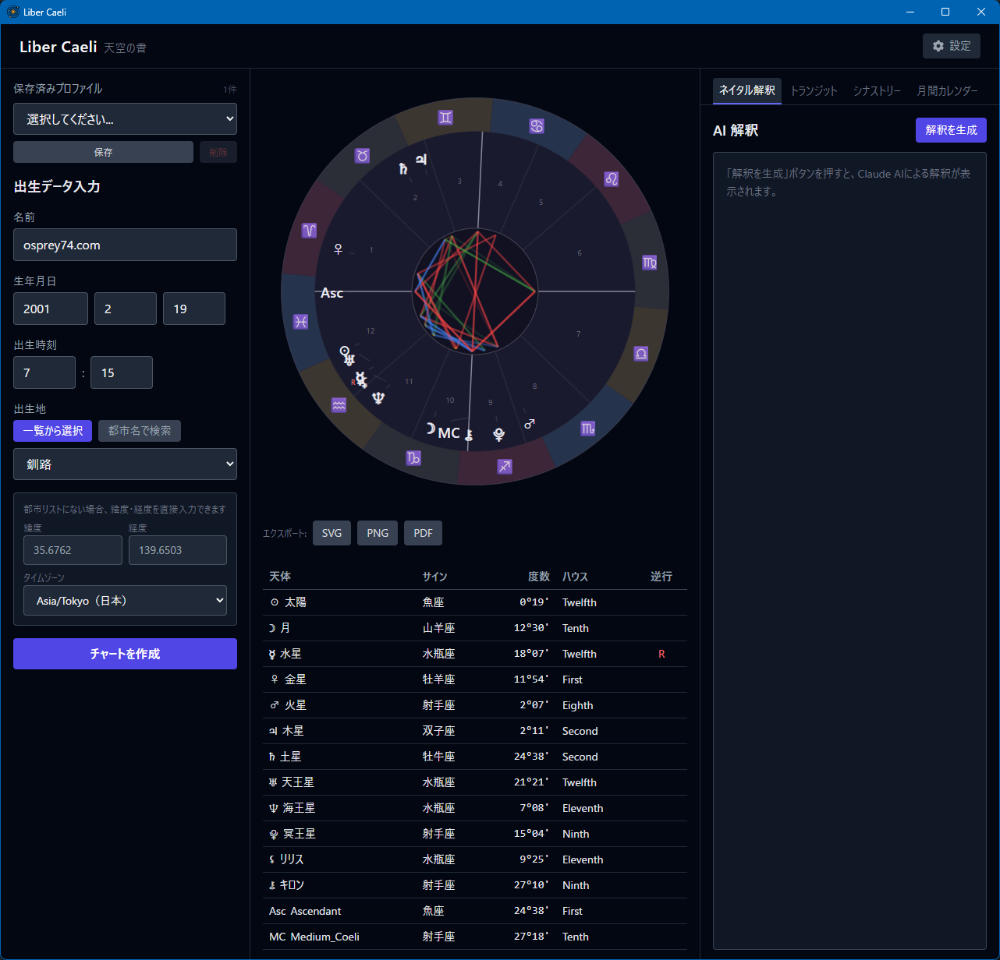
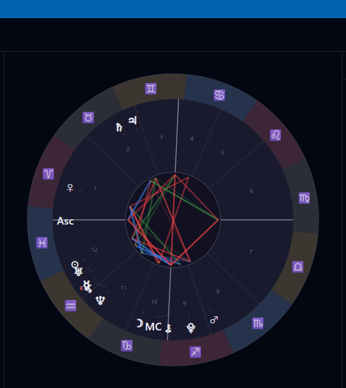
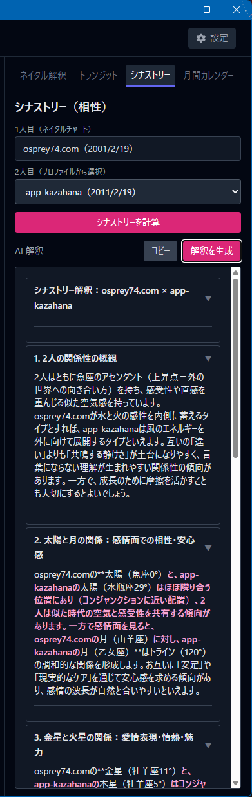
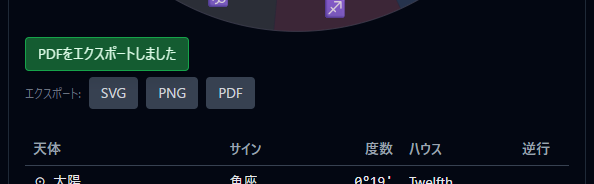
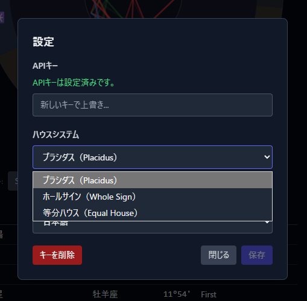

# Liber Caeli User Guide

Liber Caeli (Latin for "Book of the Heavens") is a desktop application for creating and interpreting Western astrology natal charts. It combines precise astronomical calculations with AI-powered interpretation, designed for users ranging from complete beginners to experienced practitioners.

**Supported version: Liber Caeli v1.0.6**

## Table of Contents

- [Introduction](#introduction)
- [Screen Layout](#screen-layout)
- [Creating a Natal Chart](#creating-a-natal-chart)
- [Profile Management](#profile-management)
- [Reading the Chart](#reading-the-chart)
- [House Systems](#house-systems)
- [AI Interpretation](#ai-interpretation)
- [Transit](#transit)
- [Synastry (Compatibility)](#synastry-compatibility)
- [Monthly Calendar](#monthly-calendar)
- [Export](#export)
- [Settings](#settings)
- [FAQ](#faq)
- [Astrology Quick Reference](#astrology-quick-reference)

---

## Introduction

### What Liber Caeli Can Do

- Create **natal charts** (birth charts)
- Analyze **transits** (how current planets affect your natal chart)
- Analyze **synastry** (relationship compatibility between two people)
- Display a **monthly calendar** of celestial events
- Generate **AI interpretations** automatically
- Export charts as **SVG / PNG / PDF**

### Technical Approach

- **Zodiac system**: Tropical (standard in the West and Japan)
- **House systems**: Placidus / Whole Sign / Equal House (user-selectable)
- **Calculation engine**: kerykeion (includes Swiss Ephemeris, runs offline)

---

## Screen Layout

On launch, the app displays a 3-column layout.



```
┌─ Header (Settings button) ───────────┐
├──────────┬──────────────┬───────────┤
│  Left    │   Center     │   Right    │
│  Input   │  Chart &     │   4 Tabs   │
│  Form    │  Planet Tbl  │            │
└──────────┴──────────────┴───────────┘
```

### Header

- **Liber Caeli title**
- **Settings button** — opens API key, house system, and language settings

### Left Sidebar (Input Form)


| Item | Description |
|------|-------------|
| **Profile selector** | Choose from saved profiles |
| **Name** | Chart identifier |
| **Date of birth** | Year / month / day |
| **Time of birth** | 24-hour format (HH:MM) |
| **Place of birth** | 3 methods (see below) |
| **Save** | Save current input as a new profile |
| **Delete** | Delete the selected profile |
| **Create Chart** | Generate the natal chart |

### Center Panel (Chart Display)

- **Chart wheel** — circular astrological chart (rendered with D3.js)
- **Export buttons** — SVG / PNG / PDF output
- **Planet table** — details for 13 celestial bodies

### Right Sidebar (4 Tabs)

| Tab | Function |
|-----|----------|
| **Natal** | AI interpretation of the birth chart |
| **Transit** | Analysis of current planetary influences |
| **Synastry** | Compatibility between two people |
| **Monthly Calendar** | Month's celestial events |

---

## Creating a Natal Chart

### Required Information

Three pieces of information determine chart accuracy:

| Info | Impact on accuracy |
|------|--------------------|
| **Date of birth** | Planet positions (small) |
| **Time of birth** | Ascendant, house positions (**large**) |
| **Place of birth** | Longitude/latitude for house calculation (**large**) |

> **Important:** Enter the birth time as accurately as possible. If unknown, the Ascendant (ASC) and house positions cannot be guaranteed. This is often recorded on birth certificates or baby records.

### Place of Birth Methods

Liber Caeli supports three methods for specifying place of birth.

#### Method 1: Built-in City Dictionary (Fastest)

Select from the dropdown to auto-fill coordinates and timezone.

- Japan: 65 cities (by prefecture)
- International: 17 major cities (Tokyo, New York, London, Paris, Sydney, etc.)

#### Method 2: Worldwide City Search

Search city names via the OpenStreetMap Nominatim API.


- Internet required
- Supports Japanese or English names

#### Method 3: Manual Latitude/Longitude Input

For rare locations (small islands, villages), enter coordinates directly. Timezone is auto-detected from the coordinates.

### Chart Generation Steps

1. Enter **name**, **date of birth**, **time of birth**, and **place of birth** in the left sidebar.
2. Click the **Create Chart** button.
3. The chart wheel and planet table appear in the center panel.

---

## Profile Management

### Why Profiles Are Needed

- **Single natal chart**: Just fill in the form and click **Create Chart** — no profile needed.
- **Transit**: Birth data must be **saved as a profile**.
- **Synastry**: Both people must be **saved as profiles**.

### Saving a Profile

1. Enter birth data in the left sidebar.
2. Click the **Save** button at the top.
3. The profile is registered under the entered name.

### Loading a Profile

1. Click the **Profile selector** dropdown at the top of the left sidebar.
2. Select the profile to load.
3. The form auto-fills with the profile's data.
4. Click **Create Chart** to re-render.

### Deleting a Profile

1. Select the profile to delete.
2. Click the **Delete** button.
3. Confirm in the dialog.

> **Note:** Profiles are saved as JSON in your device's app data folder. There is no cloud sync.

---

## Reading the Chart

### Chart Wheel Structure



The chart wheel consists of the following layers from outside to inside:

| Layer | Content |
|-------|---------|
| **Outermost ring** | 12 zodiac signs (Aries through Pisces) |
| **Middle** | 12 house divisions (numbered 1–12) |
| **Inner** | Planet symbols (placed by degree) |
| **Center** | Aspect lines (angular relationships between planets) |

### Planet Table


Below the chart, a table shows details for 13 celestial bodies:

| Column | Description |
|--------|-------------|
| **Planet name** | Sun, Moon, Mercury, etc. |
| **Sign** | Zodiac sign the planet is in |
| **Degree** | Position within the sign (0°–29°) |
| **House** | Which house the planet occupies |
| **Retrograde** | "R" marker if the planet is retrograde |

### Glossary Popups

**All elements on the chart (planets, signs, houses, aspects) are clickable.** Clicking opens a popup with an explanation:


- Meaning of each planet
- Symbols and qualities of each sign
- Life areas ruled by each house
- Interpretation of each aspect

The glossary contains **46 entries** available in both Japanese and English.

---

## House Systems

A house system is a method of dividing the celestial sphere into 12 regions. Different systems produce different house boundaries (cusps) from the same birth data.

### Three House Systems

| System | Characteristics | Best for |
|--------|-----------------|----------|
| **Placidus** (default) | Divides the time from horizon to meridian into thirds | Modern Western astrology standard |
| **Whole Sign** | 1 sign = 1 house (each house is 30°) | Classical/Hellenistic astrology |
| **Equal House** | 30° segments from the Ascendant | British tradition, high-latitude birthplaces |

### Notes

- When **Whole Sign** or **Equal House** is selected, the **MC (Midheaven)** is drawn as an independent point (it does not align with a house cusp).
- Changing house systems can move planets between houses (though their zodiac positions don't change).
- Changes apply to the next chart generation.

---

## AI Interpretation

Liber Caeli uses the Claude API to automatically read and interpret your chart.

### Two Usage Modes

| Mode | API key | Cost | How to use |
|------|---------|------|------------|
| **AI Interpretation** | Required | ~$0.03–$0.06 per generation | Generates and displays interpretation inside the app |
| **Prompt Generation** | Not required | Free | Copies prompt to clipboard for use with any AI service |

### Using AI Interpretation (with API key)

1. Register your Anthropic API key in **Settings** (get one at [Anthropic Console](https://console.anthropic.com/)).
2. After creating a chart, open the relevant tab in the right sidebar.
3. Click **Generate Interpretation**.
4. Text streams in real-time.
5. Sections display as collapsible accordions after completion.


### Using Prompt Generation Mode (no API key)

1. After creating a chart, open the relevant tab in the right sidebar.
2. Click **Generate Prompt**.
3. The system prompt + chart data is copied to your clipboard.
4. Paste into any AI service of your choice (ChatGPT, Claude Web, Gemini, etc.) and run.

### Interpretation Targets

- **Natal chart**: Full birth chart interpretation
- **Transit**: Current influence analysis
- **Synastry**: Compatibility interpretation
- **Monthly focus**: Themes for the selected month

### Cost Estimates

| Interpretation type | Approximate cost per generation |
|---------------------|--------------------------------|
| Natal | $0.03–$0.05 |
| Transit | $0.04–$0.06 |
| Synastry | $0.04–$0.06 |
| Monthly focus | $0.04–$0.05 |

> **Note:** API keys are saved in your device's app data folder and are never included in source code or sent anywhere except Anthropic's API.

---

## Transit

**Transit** analysis shows how current (or any date's) planetary positions affect your natal chart.


### How to Use

1. Create a natal chart (profile must be saved).
2. Open the **Transit** tab in the right sidebar.
3. Select a date (defaults to today).
4. Click **Calculate**.
5. The center chart becomes a **bi-wheel**:
   - **Inner**: Natal chart (blue tones)
   - **Outer**: Transit positions (amber tones)
6. The planet table also shows both sets.
7. Click **Generate Interpretation** or **Generate Prompt** for AI analysis.

> **Note:** Transit requires a saved profile. Save your birth data first before using this feature.

---

## Synastry (Compatibility)

**Synastry** overlays two birth charts to analyze relationship compatibility.



### How to Use

1. Save both **your** and the **other person's** profiles.
2. Load your own profile and create your chart.
3. Open the **Synastry** tab.
4. Select the **other person's profile** from the dropdown.
5. Click **Calculate Synastry**.
6. The center chart becomes a **bi-wheel**:
   - **Inner**: Your chart (blue tones)
   - **Outer**: Their chart (amber tones)
7. Click **Generate Interpretation** or **Generate Prompt** for AI compatibility analysis.

### Notes

- Ideally both profiles should have **known birth times** (for accurate ASC and houses).
- Profiles with unknown birth times will have reduced accuracy for Ascendant and Moon sign placement.

---

## Monthly Calendar

The **Monthly Calendar** shows all celestial events (new/full moons, sign ingresses, retrogrades, etc.) for a month.


### How to Use

1. Load a profile and create your chart.
2. Open the **Monthly Calendar** tab.
3. Select **month and year**.
4. Click **Calculate**.
5. Event days are highlighted in the calendar grid.
6. Click a day to see event details.

### Displayed Events

- **New / full moon**
- **Sign ingresses** (planets entering a new sign)
- **Retrograde / direct stations**
- **Major aspects to your natal chart**

### Monthly Focus (AI Interpretation)

Click **Generate Monthly Focus** to have AI interpret the month's themes.

---

## Export

### Three Export Formats

| Format | Use case | File size | Notes |
|--------|----------|-----------|-------|
| **SVG** | Printing, vector graphics | Small | Lossless, may be heavy for web |
| **PNG** | Social sharing, as an image | Medium | Fixed resolution |
| **PDF** | Documentation, archiving | Large | **Includes AI interpretation text** |

### Export Steps

1. After creating a chart, click an export button below the center panel.
2. Choose format (SVG / PNG / PDF).
3. Select save destination.
4. A toast notification confirms completion.



### Auto-Generated Filenames

Filenames are auto-generated based on chart type, name, and date:

- `John_natal_20260313.pdf`
- `Jane_transit_20260313.png`
- `John_Jane_synastry_20260313.svg`

---

## Settings

Open settings via the button in the top-right of the header.



### API Key

- Enter your **Anthropic API key** and click **Save**.
- Use **Delete** to clear an existing key.
- Keys are stored locally and never transmitted except to Anthropic's API.

### House System

Choose from:

- **Placidus** (default)
- **Whole Sign**
- **Equal House**

Changes apply to the **next chart generation**.

### Language

- **Japanese** / **English**
- Affects UI, AI interpretation, glossary, and calendar event descriptions.

---

## FAQ

### Q. OS warnings appear on first launch.

Liber Caeli is not code-signed, so warnings appear on first launch.

**macOS:**
If you see "caelum is damaged and can't be opened" or "Cannot verify the developer," run in Terminal:

```
xattr -cr /Applications/caelum.app
```

**Windows:**
If SmartScreen shows "Windows protected your PC," click "More info" → "Run anyway."

### Q. The app takes a few seconds to start.

Startup launches the Python sidecar (astronomical calculation engine), which can take 10–15 seconds. After startup, the app runs smoothly.

### Q. I don't know the exact birth time.

When birth time is unknown, many people enter **12:00 (noon)** as a guess, but be aware that the **Ascendant (ASC) and house positions will be inaccurate**. You can still use sign placements of the Sun, Moon, and planets.

### Q. My birthplace isn't in the dictionary.

You have two fallback options:

1. Switch to **Worldwide City Search** mode and search by city name (requires internet, uses Nominatim).
2. Use **Manual Input** mode to enter latitude, longitude, and timezone directly.

### Q. I want to use AI interpretation but am concerned about cost.

Use **Prompt Generation** mode — no API key needed, completely free. Liber Caeli generates a chart-data-embedded prompt → copies to clipboard → paste into ChatGPT or other AI services.

### Q. The Transit / Synastry tabs show nothing.

Transit and Synastry require **saved profiles**. Entering form values alone is not enough. Click **Save** at the top of the left sidebar first, then create the chart again.

### Q. Does Liber Caeli support sidereal astrology (e.g., Vedic)?

No. Liber Caeli uses **tropical zodiac only** (Western astrology standard). Sidereal astrology is not supported.

### Q. Why did planet positions change when I switched house systems?

Changing house systems changes the **house boundaries** (cusps), so planets may be assigned to different houses (their zodiac positions don't change). Choose based on your astrological tradition or purpose.

### Q. Can I back up my data?

Profiles are saved as JSON in your device's app data folder. Back up this folder to restore on another device manually. There is no cloud sync feature.

---

## Astrology Quick Reference

### 12 Zodiac Signs

| Symbol | Sign | Approximate dates | Element |
|--------|------|-------------------|---------|
| ♈ | Aries | Mar 21 – Apr 19 | Fire |
| ♉ | Taurus | Apr 20 – May 20 | Earth |
| ♊ | Gemini | May 21 – Jun 21 | Air |
| ♋ | Cancer | Jun 22 – Jul 22 | Water |
| ♌ | Leo | Jul 23 – Aug 22 | Fire |
| ♍ | Virgo | Aug 23 – Sep 22 | Earth |
| ♎ | Libra | Sep 23 – Oct 23 | Air |
| ♏ | Scorpio | Oct 24 – Nov 21 | Water |
| ♐ | Sagittarius | Nov 22 – Dec 21 | Fire |
| ♑ | Capricorn | Dec 22 – Jan 19 | Earth |
| ♒ | Aquarius | Jan 20 – Feb 18 | Air |
| ♓ | Pisces | Feb 19 – Mar 20 | Water |

### Celestial Bodies

| Symbol | Body | Themes |
|--------|------|--------|
| ☉ | Sun | Ego, essence, conscious self |
| ☽ | Moon | Emotions, unconscious, motherhood, daily life |
| ☿ | Mercury | Communication, thought, intellect |
| ♀ | Venus | Love, beauty, pleasure, relationships |
| ♂ | Mars | Action, drive, passion, aggression |
| ♃ | Jupiter | Expansion, fortune, growth, philosophy |
| ♄ | Saturn | Restriction, responsibility, discipline, trials |
| ♅ | Uranus | Transformation, originality, independence |
| ♆ | Neptune | Dreams, mystery, inspiration |
| ♇ | Pluto | Transformation, rebirth, deep psyche |
| ⚷ | Chiron | Wounds and healing |
| ⚸ | Lilith | Repressed desires, shadow self |
| ⊗ | Part of Fortune | Point of fortune |

### 12 Houses

| House | Life areas |
|-------|------------|
| 1st | Self, identity, appearance |
| 2nd | Money, values, possessions |
| 3rd | Communication, siblings, short trips |
| 4th | Home, roots, mother |
| 5th | Creativity, romance, children, fun |
| 6th | Work, health, daily routine |
| 7th | Partnerships, marriage, contracts |
| 8th | Transformation, sexuality, deep connections |
| 9th | Philosophy, higher education, long trips |
| 10th | Social status, career, father |
| 11th | Friends, ideals, group activities |
| 12th | Unconscious, hidden things, spirituality |

### Major Aspects

| Aspect | Angle | Quality |
|--------|-------|---------|
| **Conjunction** | 0° | Fusion/intensification (can be favorable or challenging) |
| **Opposition** | 180° | Tension, awareness |
| **Trine** | 120° | Harmony, flow (favorable) |
| **Square** | 90° | Conflict, catalyst for change |
| **Sextile** | 60° | Opportunity, cooperation (mildly favorable) |
| Semi-square | 45° | Minor friction |
| Quincunx | 150° | Adjustment tension |

> **Note:** For detailed descriptions of each element, use the **glossary popups** (click any element on the chart inside the app).
