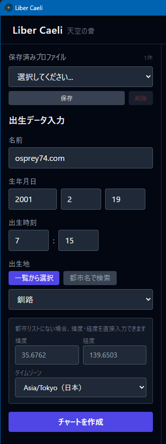
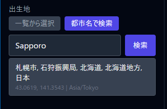
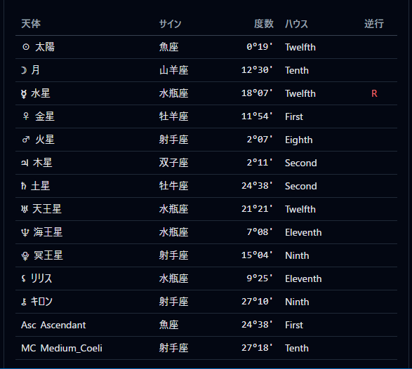
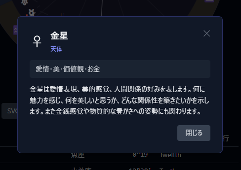
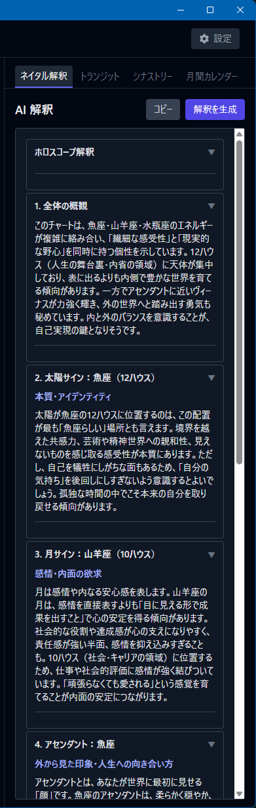
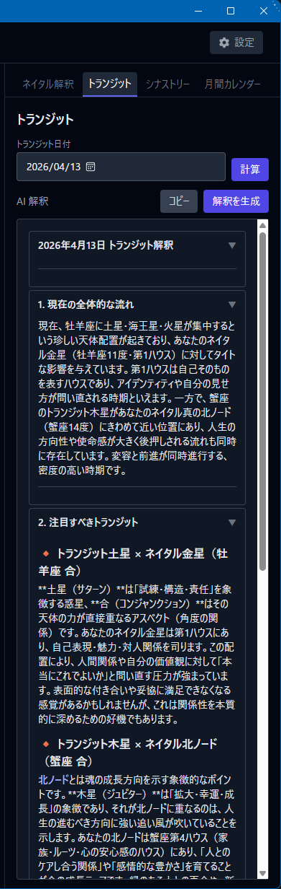
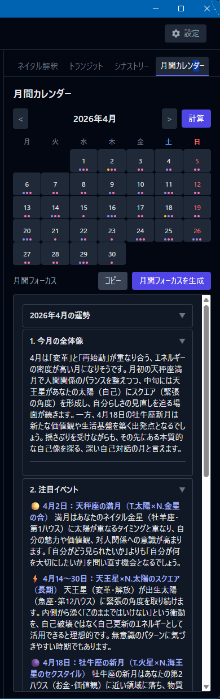

# Liber Caeli 操作マニュアル

Liber Caeli（リーベル・カエリ、ラテン語で「天空の書」）は、西洋占星術のネイタルチャート（出生チャート）を作成・解釈するためのデスクトップアプリです。精密な天体計算と AI による解釈機能を組み合わせ、初心者から実践者まで幅広く使えるように設計されています。

**対応バージョン: Liber Caeli v1.0.6**

## 目次

- [はじめに](#はじめに)
- [画面の基本構成](#画面の基本構成)
- [出生チャートを作成する](#出生チャートを作成する)
- [プロフィール管理](#プロフィール管理)
- [チャートを読む](#チャートを読む)
- [ハウスシステムについて](#ハウスシステムについて)
- [AI 解釈機能](#ai-解釈機能)
- [トランジット](#トランジット)
- [シナストリー（相性）](#シナストリー相性)
- [月間カレンダー](#月間カレンダー)
- [エクスポート](#エクスポート)
- [設定](#設定)
- [よくある質問](#よくある質問)
- [占星術用語 クイックリファレンス](#占星術用語-クイックリファレンス)

---

## はじめに

### Liber Caeli でできること

- **ネイタルチャート**（出生チャート）の作成
- **トランジット**（現在の天体が出生図に及ぼす影響）の分析
- **シナストリー**（2人の相性）の分析
- **月間カレンダー**（1ヶ月の天体イベント一覧）の表示
- **AI 解釈** による自動読解
- チャートの **SVG / PNG / PDF エクスポート**

### 採用している方式

- **黄道方式**: トロピカル方式（日本・欧米で一般的）
- **ハウスシステム**: プラシダス / ホールサイン / イコールハウス（選択可能）
- **天体計算**: kerykeion（Swiss Ephemeris 内蔵、オフライン動作）

---

## 画面の基本構成

アプリ起動時、左・中央・右の3カラムレイアウトが表示されます。


```
┌─ ヘッダー（設定ボタン）───────────────┐
├──────────┬──────────────┬───────────┤
│  左      │   中央        │   右       │
│ 入力     │ チャート＆     │ 解釈タブ   │
│ フォーム │ 惑星テーブル   │ （4種類）  │
└──────────┴──────────────┴───────────┘
```

### ヘッダー

- **Liber Caeli タイトル**
- **設定ボタン** — API キー・ハウスシステム・言語の設定を開く

### 左サイドバー（入力フォーム）



| 項目 | 説明 |
|------|------|
| **プロフィール選択** | 保存済みプロフィールから選択 |
| **名前** | チャートの識別用 |
| **生年月日** | 年・月・日 |
| **出生時刻** | 24時間表記（HH:MM） |
| **出生地** | 3通りの指定方法（後述） |
| **保存** | 現在の入力値をプロフィールとして保存 |
| **削除** | 選択中のプロフィールを削除 |
| **チャート作成** | ネイタルチャートを生成 |

### 中央パネル（チャート表示）

- **チャートホイール** — 円形の占星術チャート（D3.js）
- **エクスポートボタン** — SVG / PNG / PDF 出力
- **惑星テーブル** — 13天体の詳細情報

### 右サイドバー（4つのタブ）

| タブ | 機能 |
|------|------|
| **ネイタル** | 出生チャートの AI 解釈 |
| **トランジット** | 現在の天体影響の分析 |
| **シナストリー** | 2人の相性分析 |
| **月間カレンダー** | 月間の天体イベント一覧 |

---

## 出生チャートを作成する

### 必要な情報

出生チャートの精度を決める3つの情報：

| 情報 | 精度への影響 |
|------|--------------|
| **生年月日** | 惑星位置（小） |
| **出生時刻** | アセンダント・ハウス位置（**大**） |
| **出生地** | 経度緯度によるハウス計算（**大**） |

> **重要:** 出生時刻は可能な限り正確な時刻を入力してください。時刻が不明な場合、アセンダント（ASC）とハウス位置の精度が保証されません。出生届や母子手帳に記載されています。

### 出生地の指定方法

Liber Caeli は以下の3つの方法で出生地を指定できます。

#### 方法1: 内蔵都市辞書から選択（最速）

ドロップダウンから選択するだけで、緯度経度・タイムゾーンが自動入力されます。

- 日本国内: 65都市（都道府県別）
- 海外: 17主要都市（東京、ニューヨーク、ロンドン、パリ、シドニーなど）

#### 方法2: 世界中の都市を検索

OpenStreetMap の Nominatim API を使って、世界中の都市名から検索します。



- インターネット接続が必要
- 日本語・英語どちらでも検索可能

#### 方法3: 緯度・経度・タイムゾーンを手動入力

特殊な場所（離島、小さな町など）の場合、緯度経度を直接入力できます。タイムゾーンは座標から自動検出されます。

### チャート生成の手順

1. 左サイドバーに **名前**、**生年月日**、**出生時刻**、**出生地** を入力。
2. **チャート作成** ボタンをクリック。
3. 中央パネルにチャートホイールと惑星テーブルが表示されます。

---

## プロフィール管理

### なぜプロフィールが必要か

- **ネイタルチャート単独**: 入力フォームに値を入れて **チャート作成** するだけでOK（プロフィール保存は不要）
- **トランジット**: 出生データを **プロフィールとして保存** しておく必要があります
- **シナストリー**: 自分と相手の **両方がプロフィールとして保存** されている必要があります

### プロフィールの保存

1. 左サイドバーに出生データを入力。
2. 上部の **保存** ボタンをクリック。
3. 入力した名前でプロフィールが登録されます。

### プロフィールの読み込み

1. 左サイドバー上部の **プロフィール選択** ドロップダウンをクリック。
2. 読み込みたいプロフィールを選択。
3. フォームに自動で値が入力されます。
4. **チャート作成** をクリックしてチャートを再描画。

### プロフィールの削除

1. 削除したいプロフィールを選択。
2. **削除** ボタンをクリック。
3. 確認ダイアログで承認。

> **補足:** プロフィールは端末内のアプリデータフォルダに JSON 形式で保存されます。クラウド同期はされません。

---

## チャートを読む

### チャートホイールの構成


チャートホイールは外側から内側へ、以下の層で構成されています。

| 層 | 表示内容 |
|----|----------|
| **最外周** | 12星座の記号（牡羊座〜魚座） |
| **中間** | 12ハウスの仕切り線（1〜12の番号） |
| **内側** | 惑星記号（度数に応じて配置） |
| **中心** | アスペクト線（惑星間の角度関係） |

### 惑星テーブル



チャートの下に表示される表で、13天体の詳細を確認できます。

| 列 | 説明 |
|----|------|
| **惑星名** | 天体の名前（太陽・月・水星…） |
| **星座** | その惑星がある星座 |
| **度数** | 星座内での位置（0〜29度） |
| **ハウス** | どのハウスに入っているか |
| **逆行** | 逆行中の場合は「R」マーク |

### 用語集ポップアップ

**チャート上の要素（惑星、星座、ハウス、アスペクト）は全てクリック可能** です。クリックすると、その要素の説明がポップアップで表示されます。



- 惑星の意味
- 星座の象徴・性質
- ハウスが司る人生の領域
- アスペクトの解釈

用語集には **46項目** が収録されており、日本語・英語の両方で表示できます。

---

## ハウスシステムについて

ハウスシステムは、天球を12領域に分割する方式のことです。方式によって、同じ出生データでもハウスの境界（カスプ）が変わります。

### 3つのハウスシステム

| システム | 特徴 | 向いているケース |
|----------|------|------------------|
| **プラシダス**（デフォルト） | 地平線からの時間を3等分する方式 | 現代西洋占星術の標準 |
| **ホールサイン** | 1星座 = 1ハウス（全ハウス30度） | 古典占星術・ヘレニズム占星術 |
| **イコールハウス** | アセンダントから30度ずつ等分 | イギリス系伝統・高緯度向け |

### 注意点

- **ホールサイン** または **イコールハウス** を選択した場合、**MC（中天）** は独立したポイントとして描画されます（ハウスカスプと一致しません）。
- ハウスシステムを変更すると、同じ出生データでも惑星が所属するハウスが変わることがあります。
- 設定画面から次回チャート生成時に適用されます。

---

## AI 解釈機能

Liber Caeli は Claude API を利用して、チャートを自動で読み解く機能を搭載しています。

### 2つの利用モード

| モード | APIキー | コスト | 使い方 |
|--------|---------|--------|--------|
| **AI 解釈生成** | 必要 | $0.03〜$0.06/回程度 | アプリ内で直接解釈を生成・表示 |
| **プロンプト生成** | 不要 | 無料 | プロンプトをコピーして他の AI に貼り付け |

### AI 解釈生成の使い方（APIキーあり）

1. **設定** 画面で Anthropic API キーを登録（[Anthropic Console](https://console.anthropic.com/) で取得）。
2. チャート作成後、右サイドバーの対象タブを開く。
3. **解釈を生成する** ボタンをクリック。
4. 解釈がストリーミング表示されます（リアルタイム）。
5. 完了後、アコーディオン形式で各項目を開閉できます。



### プロンプト生成モードの使い方（APIキーなし）

1. チャート作成後、右サイドバーの対象タブを開く。
2. **プロンプトを生成する** ボタンをクリック。
3. システムプロンプト＋チャートデータがクリップボードにコピーされます。
4. ChatGPT / Claude Web / Gemini などの好きな AI サービスに貼り付けて実行。

### AI 解釈の対象

- **ネイタルチャート**: 出生チャート全体の解釈
- **トランジット**: 現在の影響分析
- **シナストリー**: 2人の相性解釈
- **月間フォーカス**: その月のテーマ解釈

### コストの目安

| 解釈種別 | 概算コスト（1回あたり） |
|----------|-------------------------|
| ネイタル | $0.03〜$0.05 |
| トランジット | $0.04〜$0.06 |
| シナストリー | $0.04〜$0.06 |
| 月間フォーカス | $0.04〜$0.05 |

> **補足:** API キーは端末のアプリデータフォルダに保存され、ソースコードには含まれません。

---

## トランジット

**トランジット** は、現在（または任意の日付）の天体が、出生チャートにどう影響しているかを見る分析です。



### 使い方

1. ネイタルチャートを作成（プロフィール保存済みのもの）。
2. 右サイドバーの **トランジット** タブを開く。
3. 日付を選択（デフォルトは今日）。
4. **計算** ボタンをクリック。
5. 中央のチャートが **2重円** に変わります：
   - **内側**: 出生チャート（青系）
   - **外側**: トランジット（アンバー系）
6. 惑星テーブルも2重円対応になります。
7. **解釈を生成する** または **プロンプトを生成する** で AI 解釈を取得できます。

> **補足:** プロフィールとして保存していないとトランジット機能は使えません。先にプロフィールを保存してください。

---

## シナストリー（相性）

**シナストリー** は、2人の出生チャートを重ねて相性を分析する機能です。


### 使い方

1. **自分** と **相手** の両方をプロフィールとして保存。
2. 自分のプロフィールを選択してチャートを作成。
3. 右サイドバーの **シナストリー** タブを開く。
4. ドロップダウンから **相手のプロフィール** を選択。
5. **シナストリーを計算** ボタンをクリック。
6. 中央のチャートが **2重円** に変わります：
   - **内側**: 自分のチャート（青系）
   - **外側**: 相手のチャート（アンバー系）
7. **解釈を生成する** または **プロンプトを生成する** で AI による相性分析を取得できます。

### 注意点

- 両方のプロフィールで **出生時刻** が分かっていることが理想です（ASC やハウスの精度のため）。
- 時刻不明のプロフィールは、アセンダントや月の星座の精度が低下します。

---

## 月間カレンダー

**月間カレンダー** では、1ヶ月の天体イベント（新月・満月・星座移動・逆行/順行など）を一覧で確認できます。



### 使い方

1. プロフィールを選択してチャートを作成。
2. 右サイドバーの **月間カレンダー** タブを開く。
3. **月・年** を選択。
4. **計算** ボタンをクリック。
5. カレンダーグリッドに、イベント発生日がハイライトで表示されます。
6. 日付をクリックすると、その日のイベント詳細が表示されます。

### 表示されるイベント

- **新月 / 満月**
- **星座移動**（惑星が次の星座に入る）
- **逆行 / 順行の開始**
- **出生チャートとの主要アスペクト**

### 月間フォーカス（AI 解釈）

**月間フォーカスを生成** ボタンをクリックすると、その月の運勢・テーマを AI が解釈します。

---

## エクスポート

### 3つのエクスポート形式

| 形式 | 用途 | ファイルサイズ | 備考 |
|------|------|----------------|------|
| **SVG** | 印刷用、ベクターグラフィック | 小 | 画質劣化なし、Web 用には重い場合あり |
| **PNG** | SNS 共有、画像として使う | 中 | 解像度固定 |
| **PDF** | ドキュメントとして保管 | 大 | **AI 解釈テキストも含まれる** |

### エクスポート手順

1. チャート作成後、中央パネル下部のエクスポートボタンをクリック。
2. 形式（SVG / PNG / PDF）を選択。
3. 保存先を指定。
4. 完了時にトースト通知が表示されます。


### ファイル名の自動生成

エクスポートファイル名は、チャート種別・名前・日付から自動生成されます。

例:
- `John_natal_20260313.pdf`
- `Jane_transit_20260313.png`
- `John_Jane_synastry_20260313.svg`

---

## 設定

ヘッダー右上の **設定** ボタンから設定画面を開きます。


### API キー

- **Anthropic API キー** を入力して **保存** をクリック。
- 既に登録済みの場合は **削除** ボタンでキーをクリアできます。
- キーはローカルに保存され、外部に送信されません。

### ハウスシステム

以下から選択します。変更は **次回チャート生成時** から適用されます。

- **Placidus（プラシダス）**（デフォルト）
- **Whole Sign（ホールサイン）**
- **Equal House（イコールハウス）**

### 言語

- **日本語** / **英語** から選択。
- UI・AI 解釈・用語集・カレンダーイベント説明すべてに反映されます。

---

## よくある質問

### Q. 初回起動時に OS の警告が表示されます

Liber Caeli はコード署名に対応していないため、初回起動時に警告が表示されます。

**macOS:**
「caelum は壊れているため開けません」または「開発元を確認できません」と表示された場合、ターミナルで以下を実行してください：

```
xattr -cr /Applications/caelum.app
```

**Windows:**
SmartScreen の警告「Windows によって PC が保護されました」が表示された場合、「詳細情報」→「実行」をクリックしてください。

### Q. アプリ起動時に少し時間がかかります

起動時に Python サイドカー（天体計算エンジン）を立ち上げるため、10〜15秒程度かかることがあります。起動後はスムーズに動作します。

### Q. 出生時刻がわかりません

出生時刻が不明な場合、一般的には **12:00（正午）** を仮入力することが多いですが、**アセンダント（ASC）とハウス位置の精度は保証されません**。太陽・月・惑星の星座の情報だけを参考にする使い方になります。

### Q. 出生地が辞書にありません

以下の方法で対応できます：

1. **世界中の都市検索** モードに切り替えて、都市名で検索（Nominatim API を使用、インターネット必須）
2. **手動入力** モードで緯度・経度・タイムゾーンを直接入力

### Q. AI 解釈を使いたいがコストが気になります

**プロンプト生成モード** を使えば、APIキーなしで無料で使えます。Liber Caeli がチャートデータを含むプロンプトを生成 → クリップボードにコピー → ChatGPT など好きな AI サービスに貼り付けて実行できます。

### Q. トランジットやシナストリーのタブに何も表示されません

トランジット・シナストリーは **プロフィールとして保存されたデータが必須** です。入力フォームに値を入れただけでは使えません。先に左サイドバー上部の **保存** ボタンでプロフィールを保存してから、再度チャートを作成してください。

### Q. サイデリアル方式（インド占星術など）には対応していますか

Liber Caeli は **トロピカル方式専用** です（西洋占星術の標準方式）。サイデリアル方式には対応していません。

### Q. ハウスシステムを変更したら、惑星の位置が変わって見えます

ハウスシステムを変えると、**ハウスの境界**（カスプ）が変わるため、同じ度数でも **別のハウスに所属する** ことがあります。惑星の星座位置は変わりません。占星術の流派・目的によって使い分けてください。

### Q. データのバックアップはできますか

プロフィールは端末のアプリデータフォルダに JSON 形式で保存されます。該当フォルダをバックアップすれば、別の端末にコピーして復元可能です（手動）。クラウド同期機能はありません。

---

## 占星術用語 クイックリファレンス

### 12星座

| 記号 | 星座 | 英語 | 期間（目安） | エレメント |
|------|------|------|-----------|------------|
| ♈ | 牡羊座 | Aries | 3/21〜4/19 | 火 |
| ♉ | 牡牛座 | Taurus | 4/20〜5/20 | 土 |
| ♊ | 双子座 | Gemini | 5/21〜6/21 | 風 |
| ♋ | 蟹座 | Cancer | 6/22〜7/22 | 水 |
| ♌ | 獅子座 | Leo | 7/23〜8/22 | 火 |
| ♍ | 乙女座 | Virgo | 8/23〜9/22 | 土 |
| ♎ | 天秤座 | Libra | 9/23〜10/23 | 風 |
| ♏ | 蠍座 | Scorpio | 10/24〜11/21 | 水 |
| ♐ | 射手座 | Sagittarius | 11/22〜12/21 | 火 |
| ♑ | 山羊座 | Capricorn | 12/22〜1/19 | 土 |
| ♒ | 水瓶座 | Aquarius | 1/20〜2/18 | 風 |
| ♓ | 魚座 | Pisces | 2/19〜3/20 | 水 |

### 天体

| 記号 | 天体 | 象徴するテーマ |
|------|------|----------------|
| ☉ | 太陽 | 自我、本質、意識的な自己 |
| ☽ | 月 | 感情、無意識、母性、日常 |
| ☿ | 水星 | コミュニケーション、思考、知性 |
| ♀ | 金星 | 愛、美、喜び、対人 |
| ♂ | 火星 | 行動、意欲、情熱、攻撃性 |
| ♃ | 木星 | 拡大、幸運、成長、哲学 |
| ♄ | 土星 | 制限、責任、規律、試練 |
| ♅ | 天王星 | 変革、独創性、独立 |
| ♆ | 海王星 | 夢、神秘、インスピレーション |
| ♇ | 冥王星 | 変容、再生、深層心理 |
| ⚷ | キロン | 傷つきと癒やし |
| ⚸ | リリス | 抑圧された欲求、影 |
| ⊗ | ポイント・オブ・フォーチュン | 幸運のポイント |

### 12ハウス

| ハウス | 司る領域 |
|--------|----------|
| 1ハウス | 自己、アイデンティティ、外見 |
| 2ハウス | お金、価値観、所有 |
| 3ハウス | コミュニケーション、兄弟姉妹、短距離旅行 |
| 4ハウス | 家庭、ルーツ、母親 |
| 5ハウス | 創造性、恋愛、子ども、娯楽 |
| 6ハウス | 仕事、健康、日常のルーティン |
| 7ハウス | パートナーシップ、結婚、契約 |
| 8ハウス | 変容、性、他者との深い関わり |
| 9ハウス | 哲学、高等教育、長距離旅行 |
| 10ハウス | 社会的地位、キャリア、父親 |
| 11ハウス | 友人、理想、グループ活動 |
| 12ハウス | 無意識、隠れたもの、スピリチュアル |

### 主要アスペクト

| アスペクト | 角度 | 性質 |
|------------|------|------|
| **コンジャンクション**（合） | 0° | 強化・融合（状況により吉凶） |
| **オポジション**（衝） | 180° | 対立・緊張、意識化 |
| **トライン**（三分） | 120° | 調和・流れ（吉） |
| **スクエア**（矩） | 90° | 葛藤・変化の契機 |
| **セクスタイル**（六分） | 60° | 機会・協力（小吉） |
| セミスクエア | 45° | 軽度の摩擦 |
| クインカンクス | 150° | 調整を要する緊張 |

> **補足:** 各要素の詳細はアプリ内の **用語集ポップアップ**（チャート上の要素をクリック）で確認できます。
